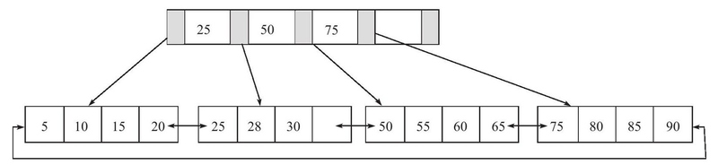
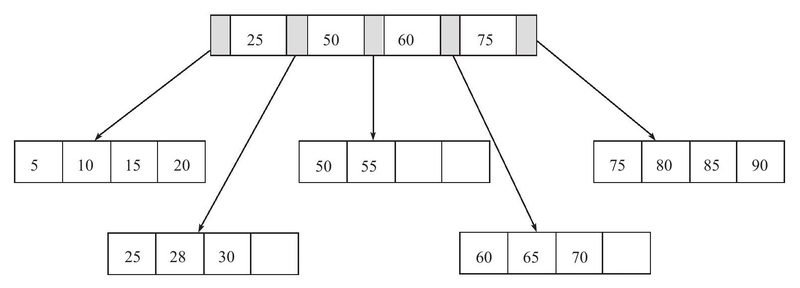
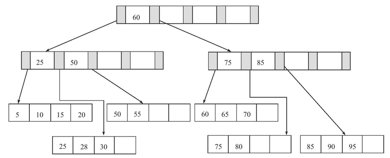
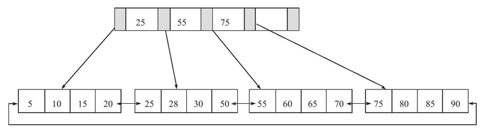
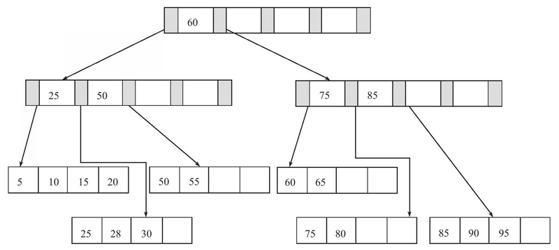
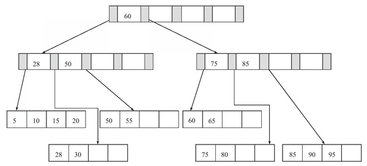
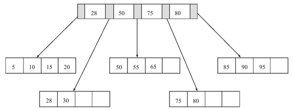
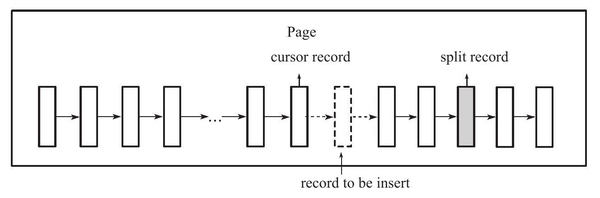
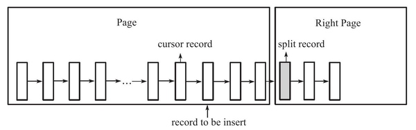
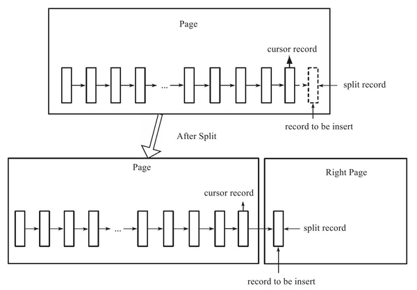

# InnoDB中的平衡树与页分裂
## Tree
### Binary Search Tree
在二叉查找树中，左子树的键值总是小于根的键值，右子树的键值总是大于根的键值。
```
        6
       / \
      3   7
     / \   \
    2   5   8
```
利用这棵二叉树对各个节点进行查找，平均查找次数为`(1+2+3+3+2+3) / 6 = 2.3`次，比起[2，3，5，6，7，8]顺序查找次数`(1+2+3+4+5+6) / 6 = 3.3`次要少。

二叉查找树还可以这样构建：
```
    2
     \
      3
       \
        5
         \
          6
           \
            7
             \
              8
```
这时查找的平均次数退化为顺序查找次数。

因此如果想高性能地构造一棵二叉查找树，需要这棵二叉查找树是**平衡**的。

### Balance Tree
平衡二叉树符合二叉查找树的定义，并且满足任何节点的两个子树高度最大差为1。

```
        6                     6
       / \                  /   \
      3   7                3     8
     / \   \              / \   / \
    2   5   8            2   5 7   9
             \
              9
```

在插入新节点后，平衡二叉树节点7的左右子树高度差为2，需要通过一次左旋操作来让树重新保持平衡。

但是有的情况可能需要旋转多次才能达到平衡。
```
      2             2             2               4    
     / \           / \           / \             / \   
    1   5         1   5         1   4           2   5  
       / \           / \           / \         / \   \ 
      4   9         4   9         3   5       1   3   9
                   /                   \                  
                  3                     9                 
```
除了插入操作，还有更新和删除操作都会导致平衡树需要进行旋转。因此维护一棵平衡树是有一定开销的。

## B+ Tree
B+树是：
- 一棵n叉树(m-ary)
- 记录节点按照键值大小顺序存放在同一层叶子节点上，各叶子节点指针进行连接

### B+ Tree插入操作
- Leaf Page未满、Index Page未满时，直接将记录插入到叶子节点
- Leaf Page满、Index Page未满时，拆分Leaf Page，将中间的节点（指的是Leaf Page几个节点的中间）放入到Index Page中，小于中间节点的记录放左边，大于中间节点的记录放右边
- Leaf Page满、Index Page满时，拆分Leaf Page，小于中间节点的记录放左边，大于中间节点的记录放右边；拆分Index Page，原理同上，此时树的高度+1

### B+ Tree删除操作
- Leaf Page大于填充因子、Index Page大于填充因子，直接删除，如果该节点是Index Page节点，用该节点的右节点代替
- Leaf Page小于填充因子、Index Page大于填充因子，合并Leaf Page和它的兄弟节点，同时更新Index Page
- Leaf Page小于填充因子、Index Page小于填充因子，合并Leaf Page和它的兄弟节点，更新Index Page，合并Index Page和它的兄弟节点

### 示例
一棵高度为2，扇出值为5的B+树：


插入键值`28`，Leaf Page和Index Page都没满，直接插入：



插入键值`70`发现Leaf Page已满，这时页的键为`[50, 55, 60, 65, 70]`，中间值为`60`，则根据`60`来**拆分**页子节点，并且将`60`放入Index Page中：



插入键值`95`，此时Leaf Page和Index Page都已满，Leaf Page为`[75, 80, 85, 90, 95]`，按照`85`拆分，并将`85`放入Index Page；Index Page为`[25, 50, 60, 75, 85]`，按照`60`拆分，并将`60`放入新的Index Page：



Rotation操作，Leaf Page已满但是左右兄弟节点没有满的情况下，不急于做拆分页的操作，将记录移到所在页的兄弟节点上。插入键值`70`时因为左Leaf Page未满，进行Rotation，`50`被Rotate到左页，`55`被Rotate上Index Page：



删除键值`70`，删除后Fill Factor大于50%，直接删除：



删除键值`25`，直接删除，但是`25`还是Index Page中的值，因此要将右侧键值`28`更新到Index Page：



删除键值`60`，删除后Fill Factor小于50%，发生**合并**操作，所在Leaf Page与左侧合并，并且更新Index Page，树高度降低：



## B+树索引
B+树索引是B+树中数据库中的实现，具有高扇出性(fanout)，通常扇出值在100以上。

B+树索引的节点在逻辑上是顺序存储的，但是在物理上因为分裂和合并的缘故，并不一定是连续的。从根节点开始向下查找每次都是随机IO。B+树因为高扇出性，高度一般在2-4层，也就是说从根节点开始查找到对应的叶子节点**最多**需要2-4次随机IO。又由于B+树索引的上层是常驻内存的，因此通常只需要更少次的随机IO即可定位到目标的叶子节点。

页是B+树索引磁盘管理的最小单位，在查询某行数据时，需要加载行所在的页到缓冲区再在页内Fetch目标行。

### B+树索引的分裂
考虑以下情况，如果页内存储的键值为`[1, 2, 3, 4, 5, 6, 7, 8]`，如果新增键值`9`时页满需要发生分裂，按照之前介绍的分裂方法，取`5`为分裂点，页分裂成`[1, 2, 3, 4]`和`[5, 6, 7, 8, 9]`两个页。如果后续的写入操作均为顺序写入，那么页`[1, 2, 3, 4]`就会永远填充不满，剩余的页同理，因此会导致页空间的浪费。

所以，B+树索引的分裂并不总是从页的中间记录开始。在InnoDB引擎的Page Header中，有以下部分用来保存插入的顺序信息：
- `PAGE_LAST_INSERT`，记录上一次写入位置的指针
- `PAGE_DIRECTION`， 值为`PAGE_LEFT`、`PAGE_RIGHT`和`PAGE_NO_DIRECTION`之一
- `PAGE_N_DIRECTION`，表示连续向同一方向插入的数量

通过这些信息，InnoDB引擎可以决定要向左还是向右分裂，分裂点记录为哪一个：
- 在随机插入的情况下，取页中间记录作为分裂点的记录
- 在定位到插入记录的位置后，如果已经向同一方向插入记录数量为5，并且当前位置后还有3条记录，则分裂点的记录定位到当前位置后到第三条记录，否则分裂点就是当前待插入的记录

向右分裂的示例：








### B+树索引的管理
通过`show index`命令可以查看表的索引情况：
```sql
mysql> show index from logistic_waybill_tracking_tab_00000087\G
*************************** 1. row ***************************
        Table: logistic_waybill_tracking_tab_00000087         -- 索引所在表名
   Non_unique: 0                                              -- 是否唯一
     Key_name: PRIMARY                                        -- 索引名
 Seq_in_index: 1                                              -- 该列在索引中的顺序
  Column_name: id                                             -- 列名
    Collation: A                                              -- 列以什么方式存储在索引中，A：排序的
  Cardinality: 6837633                                        -- 索引中唯一值的数目的估计值
     Sub_part: NULL                                           -- 是否是列的部分被索引，如100即该列前100字符被索引
       Packed: NULL                                           -- 关键字如何被压缩
         Null:                                                -- 是否索引列含有NULL值
   Index_type: BTREE                                          -- 索引类型，InnoDB均为BTREE
      Comment:
Index_comment:
*************************** 2. row ***************************
        Table: logistic_waybill_tracking_tab_00000087
   Non_unique: 1
     Key_name: idx_ticket_id
 Seq_in_index: 1
  Column_name: ticket_id
    Collation: A
  Cardinality: 629639
     Sub_part: NULL
       Packed: NULL
         Null:
   Index_type: BTREE
      Comment:
Index_comment:
*************************** 3. row ***************************
        Table: logistic_waybill_tracking_tab_00000087
   Non_unique: 1
     Key_name: idx_ticket_id
 Seq_in_index: 2
  Column_name: update_time
    Collation: A
  Cardinality: 6500525
     Sub_part: NULL
       Packed: NULL
         Null:
   Index_type: BTREE
      Comment:
Index_comment:
3 rows in set (0.04 sec)
```

### Cardinality值
Cardinality值与表的行数比应该尽可能接近1，否则说明这个索引列选择性小，可能需要考虑是否删除此索引，例如在用户表中的性别等。

Cardinality值非常关键，优化器会根据这个值来判断是否使用这个索引。它代表索引中唯一值的数目的估计值，因此真实值在每次`INSERT`、`UPDATE`、`DELETE`操作时都会改变，InnoDB不可能在每次写操作时都更新该值，因为这样做代价太大了，所以Cardinality是一个估计值，如果需要更新Cardinality信息，可以使用`ANALYZE TABLE`命令。

在InnoDB中，更新Cardinality值的策略为：
- 表中1/16的数据已经发生过变化
- stat_modified_counter > 2,000,000,000

在满足更新条件的情况下，InnoDB通过采样的方法统计Cardinality值：
- 取得B+树索引中叶子节点的数量，记为P
- 随机取所有叶子节点中的8（默认，`innodb_stats_sample_pages`配置）个叶子节点，统计每个页不同值的个数，记为N0, N1, ... ,N7
- Cardinality预估值 = (N0 + N1 + ... + N7) / 8 * P

因此，Cardinality不是一个精确值，同时，即使没有数据改动，每次统计得到的值也可能会不同。

### Online Schema Change
在MySQL 5.5版本前，对索引的增删改这类DDl操作，MySQL的操作过程为：
- 创建一张新的临时表，表结构为`ALTER`命令定义的新结构
- 将原表数据导入临时表
- 删除原表
- 临时表重命名为原表

这意味着在对大表的索引进行添加删除操作时会需要很长时间，并且服务会对其他事务不可用。

Facebook用PHP脚本实现OSC：
- init，验证表的主键、触发器、外键等是否满足
- createCopyTable，创建和原始表结构一样的新表
- alterCopyTable，对新表进行`ALTER`操作，如添加索引或列
- createDeltasTable，创建`deltas`表
- createTriggers，对原表创建`INSERT`、`UPDATE`、`DELETE`操作对触发器，触发操作产生的记录会被写到`deltas`表
- startSnpshotXact，开始OSC操作的事务
- seletTableIntoOutfile，将原表中的数据写入外部文件
- dropNCIndexs，导入数据到新表前，删除新表中的所有辅助索引
- loadCopyTable，将导出的文件导入到新表
- replayChanges，将OSC过程中原表的DML操作（保存在`deltas`表）的记录应用到新表中
- recreateNCIndexes，重新创建辅助索引
- replayChanges，再次进行DML日志的回放操作，这些操作是在重建辅助索引时产生的
- swapTables，原子的`RENAME`操作互换新旧表名

