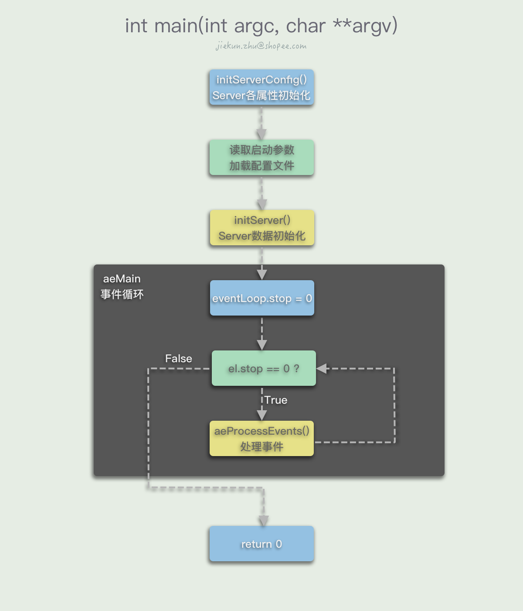
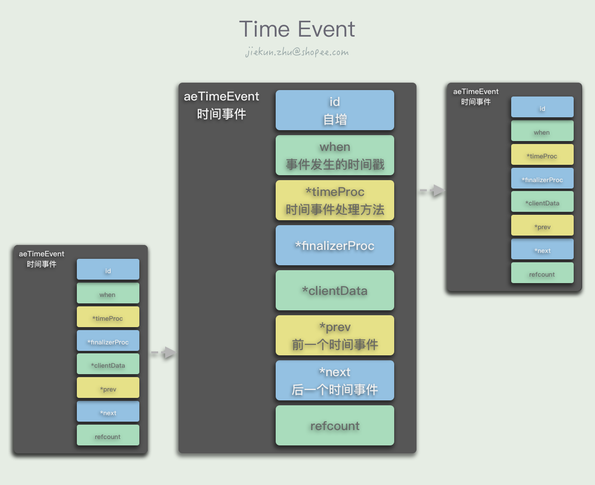
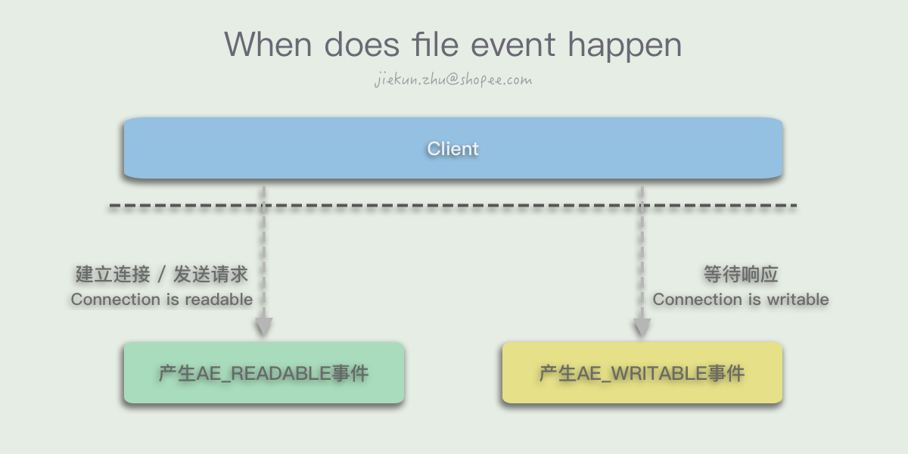
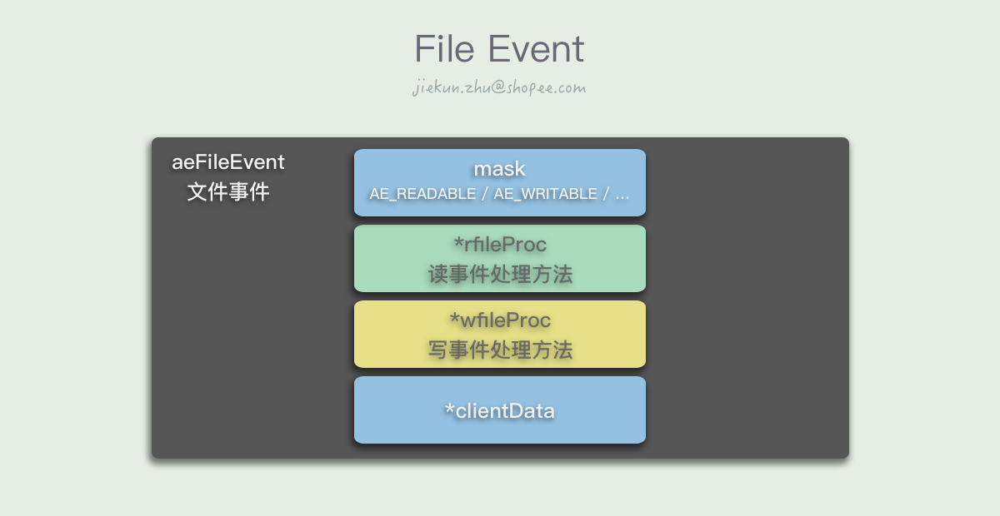
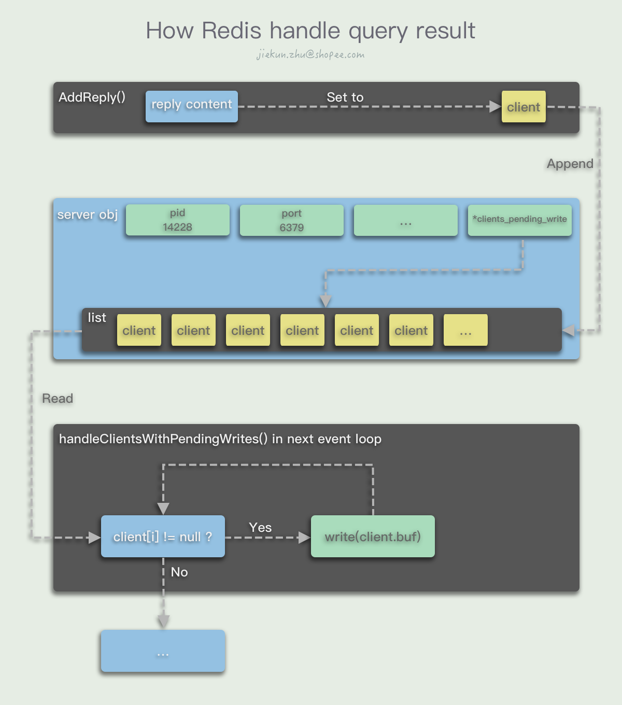
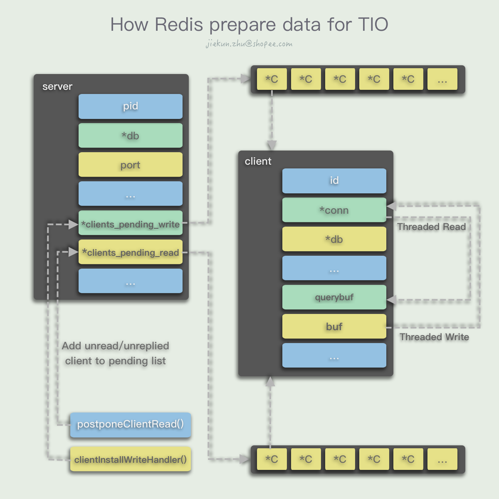
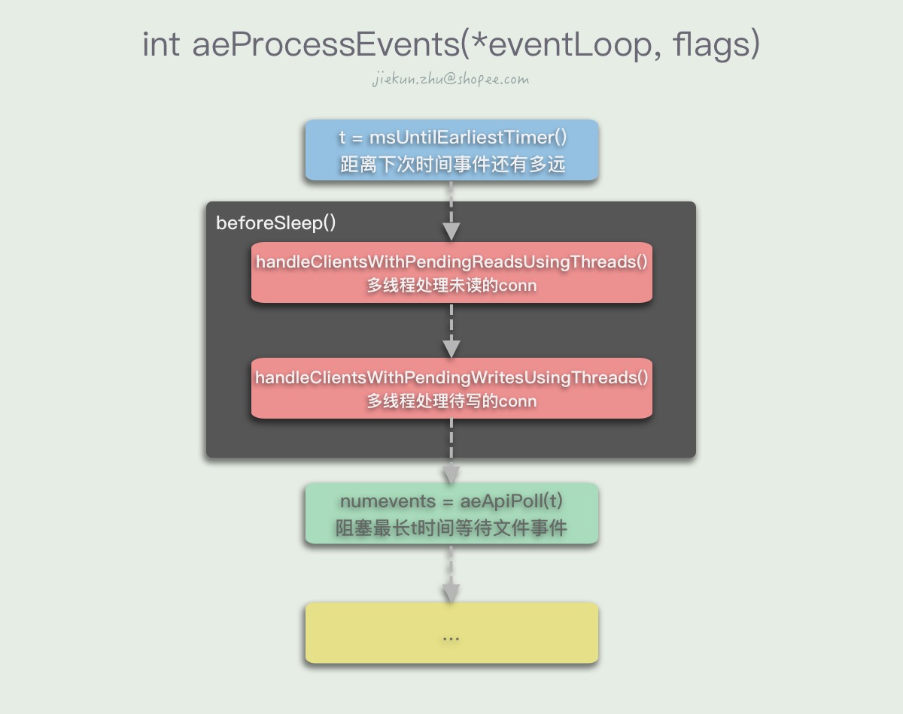

title: Redis 6.0新Feature实现原理——Threaded I/O
date: 2020-09-11 00:14:50
tags:
 - Middleware
author: jiekun.zhu@shopee.com
excerpt: Redis可以轻松支撑100k+ QPS，离不开基于Reactor模型的I/O Multiplexing，In-memory操作，以及单线程执行命令避免竞态消耗。尽管性能已经能满足大多数应用场景，但是如何继续在迭代中继续优化，以及在多核时代利用上多线程的优势，也是大家关注的重点。我们知道性能优化在系统资源层面可以从I/O以及CPU上入手，对于Redis而言，其功能不过度依赖CPU计算能力，即不是CPU密集型的应用，而In-memory的操作也绕开了通常会拖慢性能的磁盘I/O，所以在Redis 6.0版本中，作者Antirez从网络I/O入手，引入Threaded I/O辅助读写，在一些场景下实现了大幅度的性能提升。本文将介绍Redis的事件模型，分析Threaded I/O是如何帮助提升性能，以及其实现的原理。
---

Redis从6.0版本开始引入了Threaded I/O，目的是为了提升执行命令前后的网络I/O性能。本文会先从Redis的主流程开始分析，讲解网络I/O发生在哪里，以及现有的网络I/O模型，然后介绍Threaded I/O的新模型、实现以及生效场景，最后会进行场景测试，对比Threaded I/O关闭与开启，以及启用Threaded I/O与在单实例上搭建集群的性能差异。如果你已经了解过Redis的循环流程，可以直接跳至第二部分；如果你只关心新功能的实际提升，可以跳至文末的统计图表查看。

# Redis的命令执行
## 循环的aeProcessEvents
### main
Redis的入口位于server.c下，`main()`方法流程如图所示。

在`main()`方法中Redis首先需要做的事初始化各种库以及服务配置。具体举例：
- `crc64_init()`会初始化一个crc校验用的Lookup Table
- `getRandomBytes()`为`hashseed`填充随机元素作为初始化值，用作哈希表的seed
- ...
- `initServerConfig()`中执行了大量对`server`对象属性的初始化操作：
    - 初始化`server.runid`，如`16e05f486b8d41e79593a35c8b96edaff101c194`
    - 获取当前的时区信息，存放至`server.timezone`中
    - 初始化`server.next_client_id`值，使得连接进来的客户端id从1开始自增
    - ...
- `ACLInit()`是对Redis 6.0新增的ACL系统的初始化操作，包括初始化用户列表、ACL日志、默认用户等信息
- 通过`moduleInitModulesSystem()`和`tlsInit()`初始化模块系统和SSL等
- ...

初始化结束后，开始读取用户的启动参数，和大多数配置加载过程类似，Redis也通过字符串匹配等分析用户输入的`argc`和`argv[]`，这个过程中可能会发生：
- 获取到配置文件路径，修改`server.configfile`的值，后续用于加载配置文件
- 获取到启动选项参数，如`loadmodule`和对应的Module文件路径，保存至`options`变量中

解析完参数之后，执行`loadServerConfig()`，读取配置文件并与命令行参数options的内容进行合并，组成一个`config`变量，并且逐个将name和value设置进configs列表中。对于每个config，有对应的switch-case的代码，例如对于`loadmodule`，会执行`queueLoadModule()`方法，以完成真正的配置加载：
```C
...
        } else if (!strcasecmp(argv[0],"logfile") && argc == 2) {   
            ... 
        } else if (!strcasecmp(argv[0],"loadmodule") && argc >= 2) {
            queueLoadModule(argv[1],&argv[2],argc-2);
        } else if (!strcasecmp(argv[0],"sentinel")) {
...
```

回到`main`方法的流程，Redis会开始打印启动的日志，执行`initServer()`方法，服务根据配置项，继续为`server`对象初始化内容，例如：
- 创建事件循环结构体`aeEventLoop`（定义在ae.h），赋值给`server.el`
- 根据配置的db数目，分配大小为`sizeof(redisDb) * dbnum`的内存空间，`server.db`保存这块空间的地址指针
- 每个db都是一个redisDb结构，将这个结构中的保存key、保存过期时间等的字典初始化为空dict
- ...

此后就是一些根据不同运行模式的初始化，例如常规模式运行时会记录常规日志、加载磁盘持久化的数据；而在sentinel模式运行时记录哨兵日志，不加载数据等。

在所有准备操作都完成后，Redis开始陷入`aeMain()`的事件循环，在这个循环中会不断执行`aeProcessEvents()`处理发生的各种事件，直到Redis结束退出。

### 两种事件
Redis中存在有两种类型的事件：时间事件、文件事件。

时间事件也就是到了一定事件会发生的事件，在Redis中它们被记录成一个链表，每次创建新的事件事件的时候，都会在链表头部插入一个`aeTimeEvent`节点，其中保存了该事件会在何时发生，需要调用什么样的方法处理。遍历整个链表我们可以知道离最近要发生的时间事件还有多久，因为链表里面的节点按照自增id顺序排列，而在发生时间的维度上时乱序的。


文件事件可以看作I/O引起的事件，客户端发送命令会让服务端产生一个读I/O，对应一个读事件；同样当客户端等待服务端回复的时候需要变得可写，让服务端写入回复，因此会对应一个写事件。`AE_READABLE`事件会在客户端建立连接、发送命令或其他连接变得可读的时候发生，而`AE_WRITABLE`事件则会在客户端连接变得可写的时候发生。


文件事件的结构简单很多，`aeFileEvent`记录了这是一个可读事件还是可写事件，对应的处理方法，以及用户数据。


如果同时发生了两种事件，Redis会优先处理`AE_READABLE`事件。

### aeProcessEvents
`aeProcessEvents()`方法处理已经发生和即将发生的各种事件。


在`aeMain()`循环进入`aeProcessEvents()`后，Redis首先检查下一次的时间事件会在什么时候发生，在还没有时间事件发生的这段时间内，可以调用多路复用的API `aeApiPoll()`阻塞并等待文件事件的发生。如果没有文件事件发生，那么超时后返回0，否则返回已发生的文件事件数量`numevents`。

在有文件事件可处理的情况下，Redis会调用`AE_READABLE`事件的`rfileProc`方法以及`AE_WRITABLE`事件的`wfileProc`方法进行处理：
```C
...
            if (!invert && fe->mask & mask & AE_READABLE) {
                fe->rfileProc(eventLoop,fd,fe->clientData,mask);
                fired++;
                fe = &eventLoop->events[fd];
            }

            if (fe->mask & mask & AE_WRITABLE) {
                if (!fired || fe->wfileProc != fe->rfileProc) {
                    fe->wfileProc(eventLoop,fd,fe->clientData,mask);
                    fired++;
                }
            }
...
```

在完成前面的处理后，Redis会继续调用`processTimeEvents()`处理时间事件。遍历整个时间事件链表，如果此时已经过了一段时间（阻塞等待或处理文件事件耗时），有时间事件发生，那么就调用对应时间事件的`timeProc`方法，将所有已经过时的时间事件处理掉：
```C
...
        if (te->when <= now) {
            ...
            retval = te->timeProc(eventLoop, id, te->clientData);
            ...
            processed++;
            ...
        }
...
```
如果执行了文件事件之后还没有到最近的时间事件发生点，那么本次`aeMain()`循环中将没有时间事件被执行，进入下一次循环。

## 命令执行前后发生了什么
在客户端连接上Redis的时候，通过执行`connSetReadHandler(conn, readQueryFromClient)`，设置了当读事件发生时，使用`readQueryFromClient()`作为读事件的Handler。

在收到客户端的命令请求时，Redis进行一些检查和统计后，调用`read()`方法将连接中的数据读取进`client.querybuf`消息缓冲区中：
```C
void readQueryFromClient(connection *conn) {
    ...
    nread = connRead(c->conn, c->querybuf+qblen, readlen);
    ...


static inline int connRead(connection *conn, void *buf, size_t buf_len) {
    return conn->type->read(conn, buf, buf_len);
}

static int connSocketRead(connection *conn, void *buf, size_t buf_len) {
    int ret = read(conn->fd, buf, buf_len);
    ...
}
```

然后进入`processInputBuffer(c)`开始读取输入缓冲区中的消息，最后进入`processCommand(c)`开始处理输入的命令。

在命令执行得到结果后，首先会存放在`client.buf`中，并且调用调用`addReply(client *c, robj *obj)`方法，将这个`client`对象追加到`server.clients_pending_write`列表中。此时当次的命令，或者说`AE_READABLE`事件就已经基本处理完毕了，除了一些额外的统计数据、后处理以外，不会再进行发送响应消息的动作。



在当前`aeProcessEvents()`方法结束后，进入下一次的循环，第二次循环调用I/O多路复用接口等待文件事件发生前，Redis会检查`server.clients_pending_write`是否有客户端需要进行回复，若有，遍历指向各个待回复客户端的`server.clients_pending_write`列表，逐个将客户端从中删除，并将待回复的内容通过`writeToClient(c,0)`回复出去
```C
int writeToClient(client *c, int handler_installed) {
    ...
    nwritten = connWrite(c->conn,c->buf+c->sentlen,c->bufpos-c->sentlen);
    ...

static inline int connWrite(connection *conn, const void *data, size_t data_len) {
    return conn->type->write(conn, data, data_len);
}

static int connSocketWrite(connection *conn, const void *data, size_t data_len) {
    int ret = write(conn->fd, data, data_len);
    ...
}
```

# Threaded I/O模型
## I/O问题与Threaded I/O的引入
如果要说Redis会有什么性能问题，那么从I/O角度，由于它没有像其他Database一样使用磁盘，所以不存在磁盘I/O的问题。在数据进入缓冲区前及从缓冲区写至Socket时，存在一定的网络I/O，特别是写I/O对性能影响比较大。以往我们会考虑做管道化来减小网络I/O的开销，或者将Redis部署成Redis集群来提升性能。

在Redis 6.0之后，由于Threaded I/O的引入，Redis开始支持对网络读写的线程化，让更多的线程参与进这部分动作中，同时保持命令的单线程执行。这样的改动从某种程度上说可以既提升性能，但又避免将命令执行线程化而需要引入锁或者其他方式解决并行执行的竞态问题。

## Threaded I/O在做什么
在老版本的实现中，Redis将不同client的命令执行结果保存在各自的`client.buf`中，然后把待回复的`client`存放在一个列表里，最后在事件循环中逐个将`buf`的内容写至对应Socket。对应在新版本中，Redis使用多个线程完成这部分操作。


对读操作，Redis同样地为`server`对象新增了一个`clients_pending_read`属性，当读事件来临时，判断是否满足线程化读的条件，如果满足，那么执行延迟读操作，将这个`client`对象添加到`server.clients_pending_read`列表中。和写操作一样，留到下一次事件循环时使用多个线程完成读操作。


# Threaded I/O的实现与限制
## Init阶段
在Redis启动时，如果满足对应参数配置，会进行I/O线程初始化的操作。
```C
void initThreadedIO(void) {
    server.io_threads_active = 0;
    if (server.io_threads_num == 1) return;

    if (server.io_threads_num > IO_THREADS_MAX_NUM) {
        serverLog(LL_WARNING,"Fatal: too many I/O threads configured. "
                             "The maximum number is %d.", IO_THREADS_MAX_NUM);
        exit(1);
    }
...
```
Redis会进行一些常规检查，配置数是否符合开启多线程I/O的要求。
```C
...
    for (int i = 0; i < server.io_threads_num; i++) {
        io_threads_list[i] = listCreate();
...
```
创建一个长度为线程数的`io_threads_list`列表，列表的每个元素都是另一个列表L，L将会用来存放对应线程待处理的多个`client`对象。
```C
        if (i == 0) continue;
```
对于主线程，初始化操作到这里就结束了。
```C
...
        pthread_t tid;
        pthread_mutex_init(&io_threads_mutex[i],NULL);
        io_threads_pending[i] = 0;
        pthread_mutex_lock(&io_threads_mutex[i]); /* Thread will be stopped. */
        if (pthread_create(&tid,NULL,IOThreadMain,(void*)(long)i) != 0) {
            serverLog(LL_WARNING,"Fatal: Can't initialize IO thread.");
            exit(1);
        }
        io_threads[i] = tid;
    }
}
...
```
`io_threads_mutex`是一个互斥锁列表，`io_threads_mutex[i]`即第`i`个线程的锁，初始化之后将其暂时锁定。然后再对每个线程执行创建操作，`tid`即其指针，保存至`io_threads`列表中。新的线程会一直执行`IOThreadMain`方法，我们将它放到最后讲解。

## Reads/Writes
多线程的读写主要在`handleClientsWithPendingReadsUsingThreads()`和`handleClientsWithPendingWritesUsingThreads()`中完成，因为两者几乎是对称的，所以这里只对写操作进行讲解，有兴趣的同学可以检查一下读操作有什么不同的地方以及为什么。
```C
int handleClientsWithPendingReadsUsingThreads(void) {
    if (!server.io_threads_active || !server.io_threads_do_reads) return 0;
    int processed = listLength(server.clients_pending_read);
    if (processed == 0) return 0;

    if (tio_debug) printf("%d TOTAL READ pending clients\n", processed);
...
```
同样，Redis会进行常规检查，是否启用线程化读写并且启用线程化读（只开启前者则只有写操作是线程化），以及是否有等待读取的客户端。
```C
...
    listIter li;
    listNode *ln;
    listRewind(server.clients_pending_read,&li);
    int item_id = 0;
    while((ln = listNext(&li))) {
        client *c = listNodeValue(ln);
        int target_id = item_id % server.io_threads_num;
        listAddNodeTail(io_threads_list[target_id],c);
        item_id++;
    }
...
```
这里将`server.clients_pending_read`的列表转化为方便遍历的链表，然后将列表的每个节点（`*client`对象）以类似Round-Robin的方式分配个各个线程，这样可以保持多线程读取之后的各个client/指令的先后顺序不变。
```C
...
    io_threads_op = IO_THREADS_OP_READ;
...
```
设置状态标记，标识当前处于多线程读的状态。由于标记的存在，Redis的Threaded I/O瞬时只能处于读或写的状态，不能部分线程读，部分写。
```C
...
    for (int j = 1; j < server.io_threads_num; j++) {
        int count = listLength(io_threads_list[j]);
        io_threads_pending[j] = count;
    }
...
```
为每个线程记录下各自需要处理的客户端数量。当不同线程读取到自己的pending长度不为0时，就会开始进行处理。注意`j`从1开始，意味着`0`的主线程的pending长度一直为0，因为主线程马上要在这个方法中同步完成自己的任务。
```C
...
    listRewind(io_threads_list[0],&li);
    while((ln = listNext(&li))) {
        client *c = listNodeValue(ln);
        readQueryFromClient(c->conn);
    }
    listEmpty(io_threads_list[0]);
...
```
主线程此时将自己要处理的client处理完。
```C
...
    while(1) {
        unsigned long pending = 0;
        for (int j = 1; j < server.io_threads_num; j++)
            pending += io_threads_pending[j];
        if (pending == 0) break;
    }
    if (tio_debug) printf("I/O READ All threads finshed\n");
...
```
陷入循环等待，`pending`等于各个线程剩余任务数之和，当所有线程都没有任务的时候，本轮I/O处理结束。
```C
...
    while(listLength(server.clients_pending_read)) {
        ln = listFirst(server.clients_pending_read);
        client *c = listNodeValue(ln);
        c->flags &= ~CLIENT_PENDING_READ;
        listDelNode(server.clients_pending_read,ln);

        if (c->flags & CLIENT_PENDING_COMMAND) {
            c->flags &= ~CLIENT_PENDING_COMMAND;
            if (processCommandAndResetClient(c) == C_ERR) {
                continue;
            }
        }
        processInputBuffer(c);
    }
...
```
我们已经在各自线程中将`conn`中的内容读取至对应client的`client.querybuf`输入缓冲区中，所以可以遍历`server.clients_pending_read`列表，串行地进行命令执行操作，同时将`client`从列表中移除。
```C
...
    server.stat_io_reads_processed += processed;

    return processed;
}
```
处理完成，将处理的数量加到统计属性上，然后返回。

## IOThreadMain
前面还有每个线程具体的工作内容没有解释，它们会一直陷在`IOThreadMain`的循环中，等待执行读写的时机。
```C
void *IOThreadMain(void *myid) {
    long id = (unsigned long)myid;
    char thdname[16];

    snprintf(thdname, sizeof(thdname), "io_thd_%ld", id);
    redis_set_thread_title(thdname);
    redisSetCpuAffinity(server.server_cpulist);
...
```
照常执行一些初始化内容。
```C
...
    while(1) {
        for (int j = 0; j < 1000000; j++) {
            if (io_threads_pending[id] != 0) break;
        }

        if (io_threads_pending[id] == 0) {
            pthread_mutex_lock(&io_threads_mutex[id]);
            pthread_mutex_unlock(&io_threads_mutex[id]);
            continue;
        }


        serverAssert(io_threads_pending[id] != 0);

        if (tio_debug) printf("[%ld] %d to handle\n", id, (int)listLength(io_threads_list[id]));
...
```
线程会检测自己的待处理的client列表长度，当等待队列长度大于0时往下执行，否则会到死循环起点。
```C
...
        listIter li;
        listNode *ln;
        listRewind(io_threads_list[id],&li);
        while((ln = listNext(&li))) {
            client *c = listNodeValue(ln);
            if (io_threads_op == IO_THREADS_OP_WRITE) {
                writeToClient(c,0);
            } else if (io_threads_op == IO_THREADS_OP_READ) {
                readQueryFromClient(c->conn);
            } else {
                serverPanic("io_threads_op value is unknown");
            }
        }
...
```
将`io_threads_list[i]`的客户端列表转化为方便遍历的链表，逐个遍历，借助`io_threads_op`标志判断当前是要执行多线程读还是多线程写，完成对自己要处理的客户端的操作。
```C
...
        listEmpty(io_threads_list[id]);
        io_threads_pending[id] = 0;

        if (tio_debug) printf("[%ld] Done\n", id);
    }
}
```
清空自己要处理的客户端列表，并且将自己的待处理数量修改为0，结束本轮操作。
## Limitation
通过查看代码，使用上Threaded I/O的启用受以下条件影响：
- 配置项`io-threads`需要大于1，否则会继续使用单线程操作读写I/O
- 配置项`io-threads-do-reads`控制读I/O是否使用线程化
- 对于延迟读取，由`postponeClientRead()`方法控制。方法中除了配置要求外，还有当前client不能是主从模型的角色，也不能处于已经等待下次事件循环线程化读取（`CLIENT_PENDING_READ`）的状态。在这个方法中`client`对象会被添加到等待队列中，并且将client的状态改为`CLIENT_PENDING_READ`。
- 对于多线程写I/O，由`handleClientsWithPendingWritesUsingThreads()`中的`stopThreadedIOIfNeeded()`方法加以限制。除了对应配置项要满足要求外，`server.clients_pending_write`的长度需要大于等于配置线程数的两倍，例如配置使用6线程，当写队列长度小于12时会继续使用单线程I/O。

# 性能测试
## Threaded I/O on vs. Threaded I/O off
## Threaded I/O vs. Redis Cluster vs. Codis
# 总结与思考